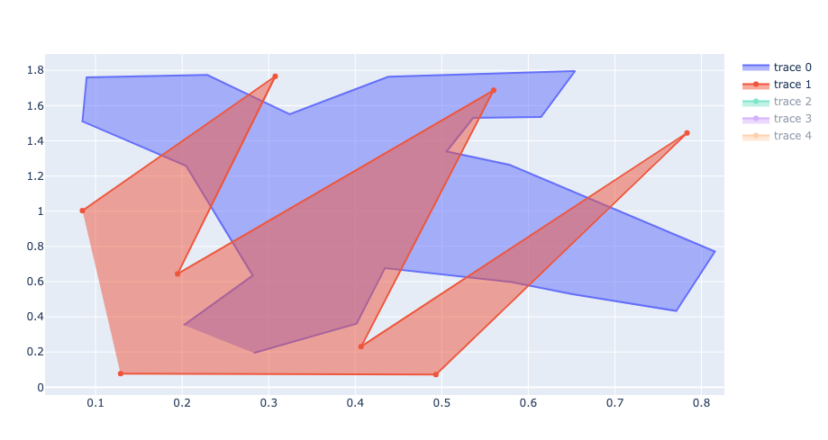
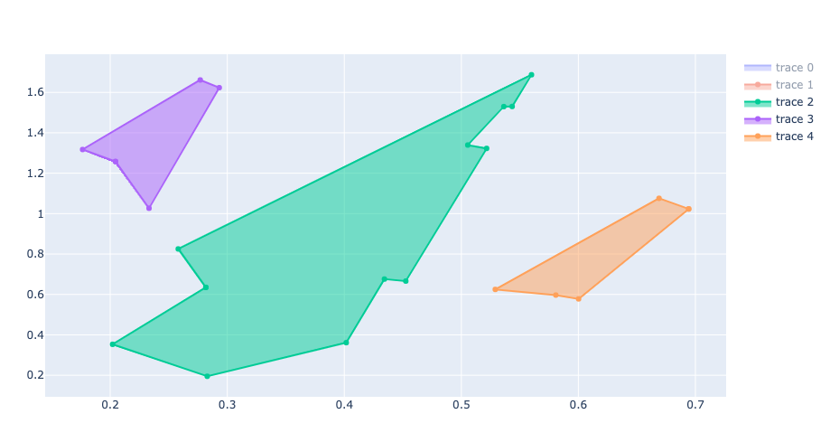

# SimplePolyIntersect.jl

The small module `SimplePolyIntersect.jl` provides two methods, 

- `polyintersection(poly1, poly2; open_out)`
- `polyintersects(poly1, poly2)` 

This amounts to an interface to the `intersection` and `intersects` functions of [LibGEOS.jl](https://github.com/JuliaGeo/LibGEOS.jl).

## Usage

Add and include the file `SimplePolyIntersect.jl` to your project. Each of `poly1` and `poly2` should be given as $N \times 2$ matrices of points or a vector of 2-d points. The polygon can be closed (i.e. the last point is repeat of the first) or open. The output is a vector of matrices of the intersection polygon if it exists, and `false` otherwise. 

```julia
p1 = [0 0 ; 0 1 ; 1 1 ; 1 0 ]; # a square
p2 = p1 .+ 0.5; # the same square shifted up and right by 0.5
p3 = p1 .+ 10; # a very distant square

polyintersection(p1, p2)[1]

"""
5×2 Matrix{Float64}:
 1.0  1.0
 1.0  0.5
 0.5  0.5
 0.5  1.0
 1.0  1.0
"""

polyintersection(p1, p3)

"""
false
"""
```

Note that the default of `polyinersection` is to return vertices of the intersection "closed;" repeating the first vertex at the end. This can be toggled with the named argument `open_out = true`.

If you just want to know whether `poly1` and `poly2` intersect, `polyintersects(poly1, poly2)` can be faster.

```julia
using BenchmarkTools

@btime polyintersection(p1, p3)

"""
  5.208 μs (76 allocations: 3.53 KiB)
false
"""

@btime polyintersects(p1, p3)

"""
  4.726 μs (66 allocations: 3.09 KiB)
false
"""
```

## Demo

Add [PlotlyJS](https://github.com/JuliaPlots/PlotlyJS.jl) if you don't already have it installed.

```julia
include("demo/demo.jl")
```

The red and blue polygons are the ones we wish to intersect.



We can then see that there are three polygons disconnected from each other that make up the intersection.


